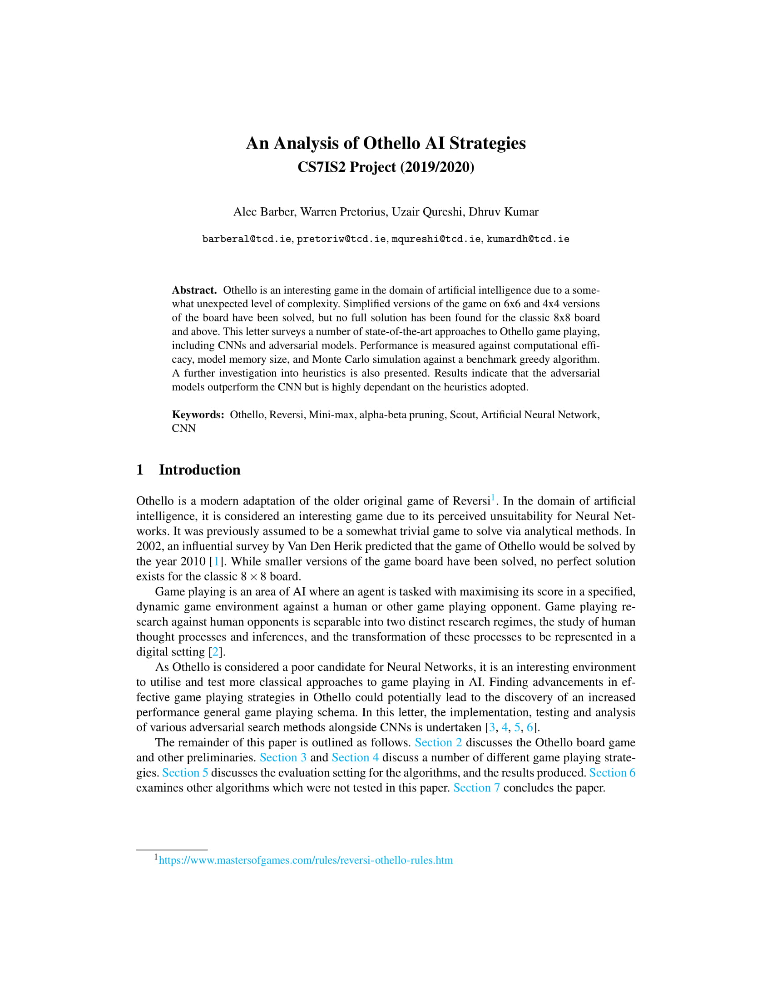
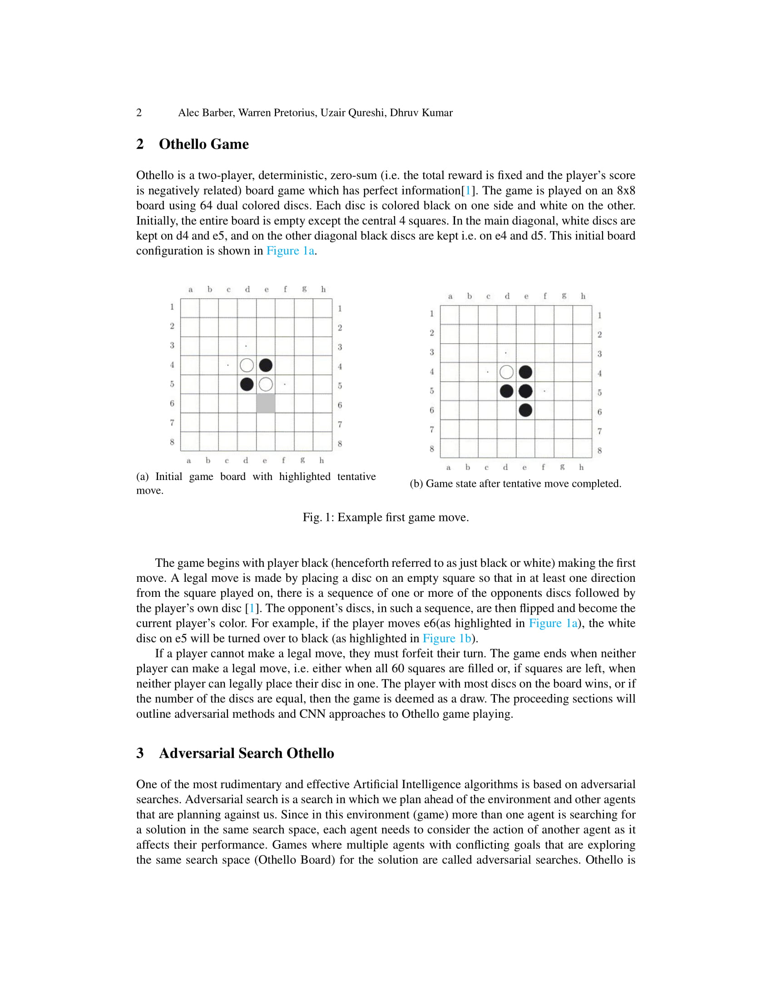
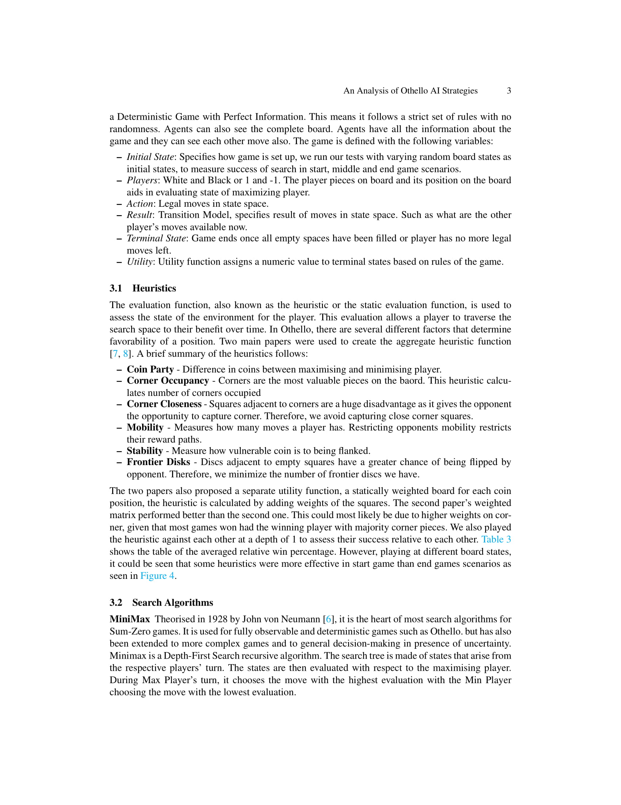
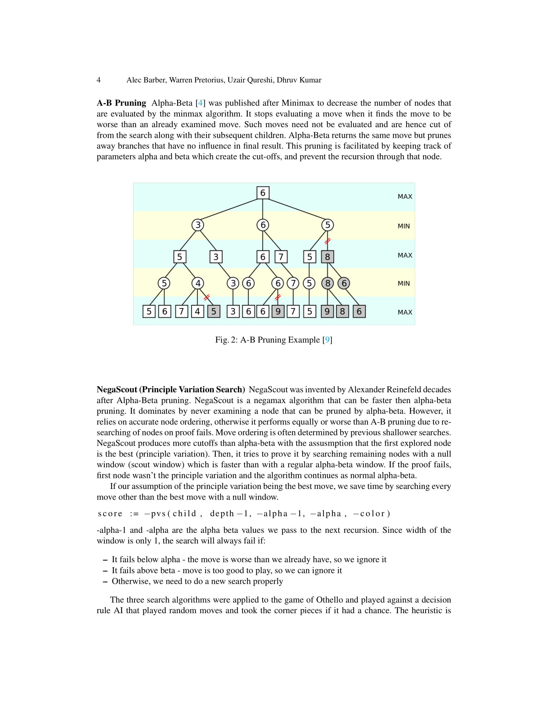
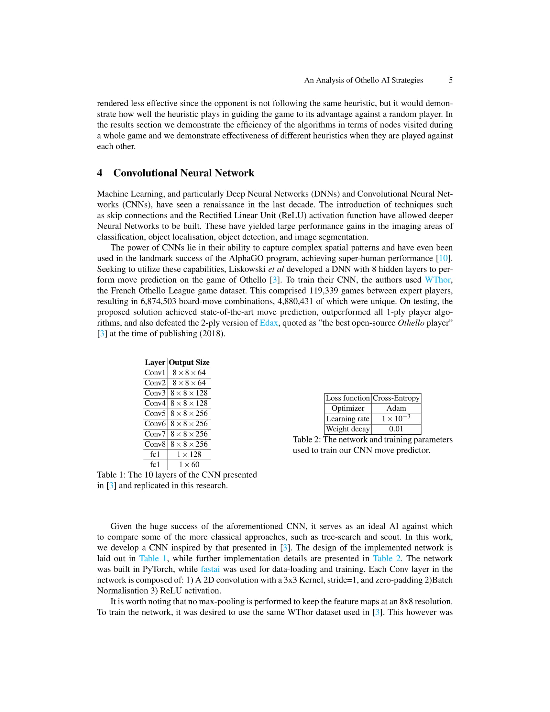
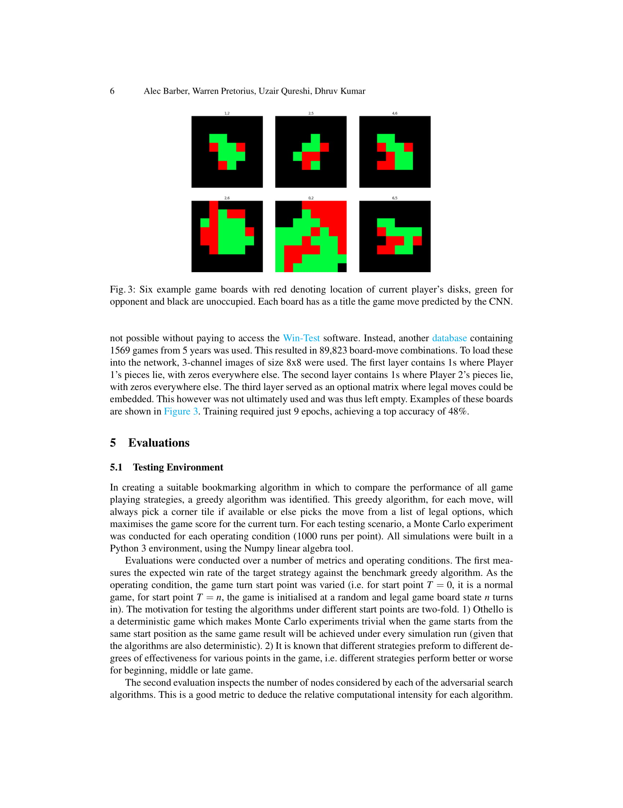
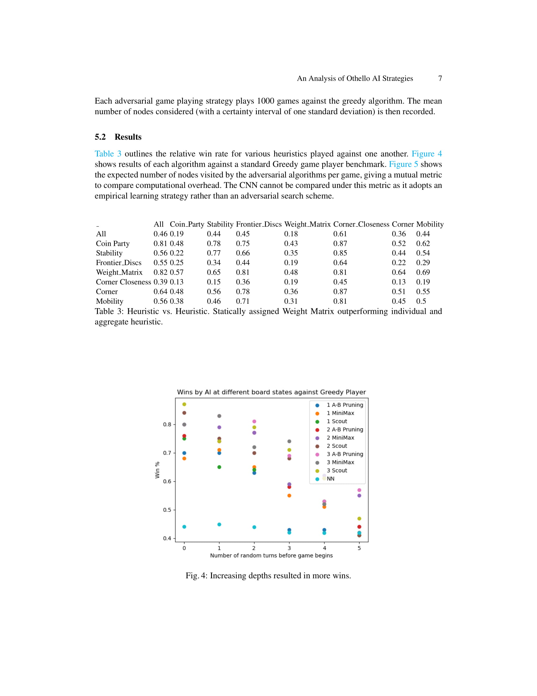
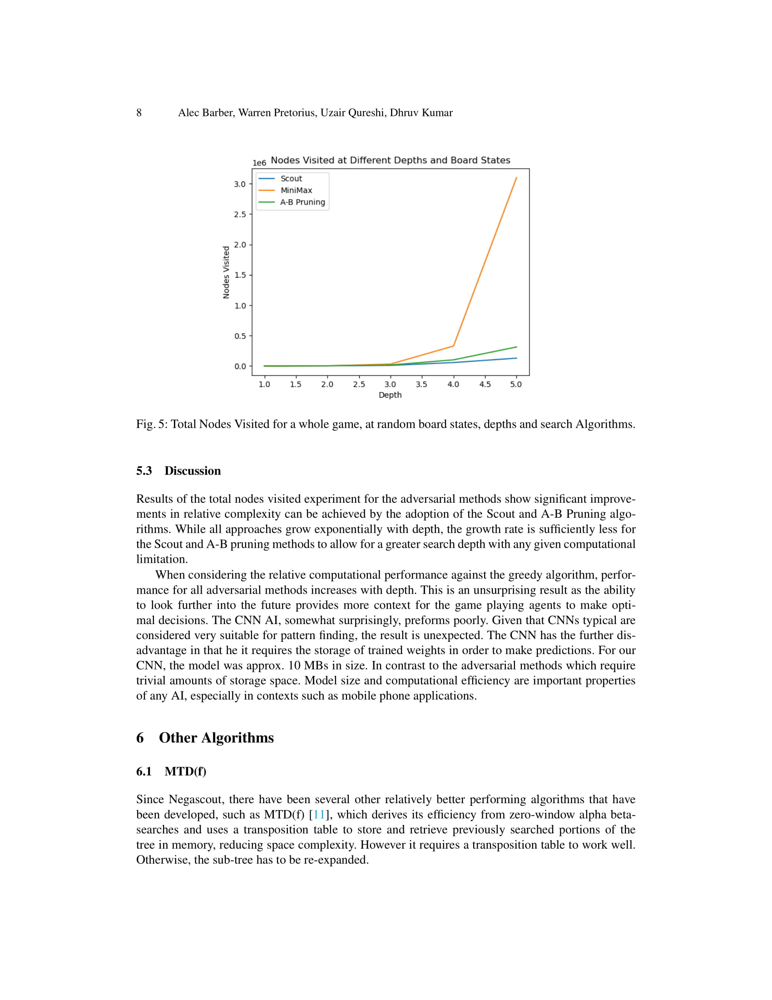
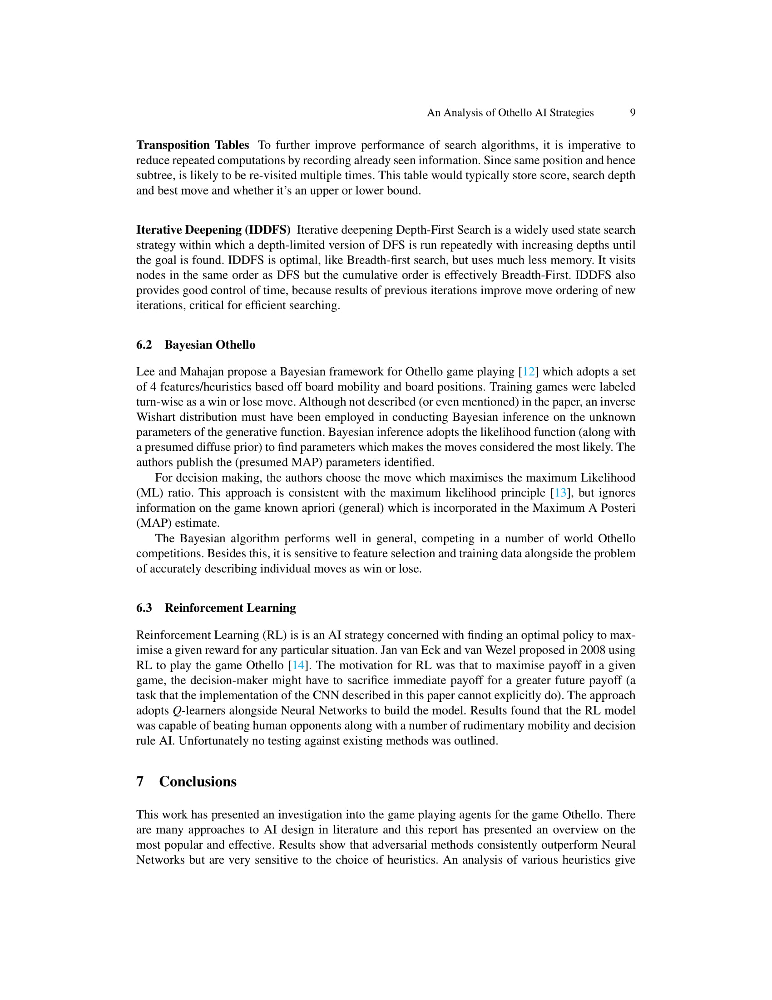
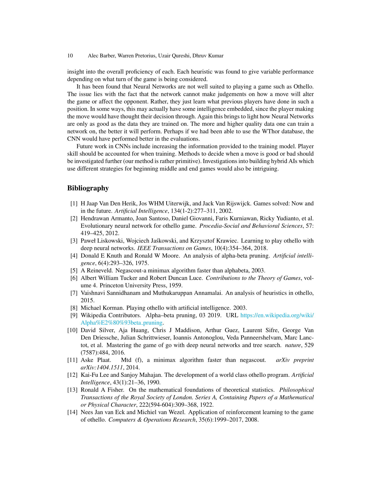

# Submission for CS7_IS2 Artificial Intelligence State-Of-The-Art Assignment
## Assignment Goal
To analyse and evaluate state-of-the-art AI algorithms to solve a problem of your choice.

## Team Members:
* Alec Barber
* Warren Pretorius
* Uzair Qureshi
* Dhruv Kumar

## Othello Game

> Reversi is a strategy board game for two players, played on an 8×8 uncheckered board. There are sixty-four identical game pieces called disks (often spelled "discs"), which are light on one side and dark on the other. Players take turns placing disks on the board with their assigned color facing up. During a play, any disks of the opponent's color that are in a straight line and bounded by the disk just placed and another disk of the current player's color are turned over to the current player's color.
> The object of the game is to have the majority of disks turned to display your color when the last playable empty square is filled.
> The game of Reversi was invented in 1883. A modern Mattel game, published as Othello and with a change to the board's initial setup, was patented in 1971. 
(From Wikipedia)

## Algorithms Investigated
- [x] Nearal Networks
- [X] MiniMax
- [x] Alpha-Beta Pruning
- [x] Nega Scout

## Dependancy Management
# PipEnv 
Used for managing dependencies in python project
- `pipenv shell` - activate virtual environment 
- `exit` - exit/(deactivate) virtual environment
- `pipenv run python` - runs python 
- `pipenv install pytest (--dev)` - Add new package and save to pipfile 
- `pipenv --rm` - Removes Virtual Environment Dir (All necessary vars to rebuild still in pipFile)
- `pipenv run python algo_eval.py` - Runs Evaluation between MinMax (X) and decisionRule_ai(O) 
- `pipenv --venv` - Get path to Virtual Environment
- `pipenv install` - Installs dependencies from pipfile

## An Analysis of Othello AI Strategies

_________________

_________________

_________________

_________________

_________________

_________________

_________________

_________________

_________________

